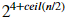

# Fun with ConvNets

This repository contains a pure numpy (no other third-party libraries have been used) implementation of a convolutional neural network. The model then has been trained on the [CIFAR-10](https://www.cs.toronto.edu/~kriz/cifar.html) dataset, which contains 60000 `32x32x3` images in 10 different classes. The trained model is used for all kinds of visualization purposes, and creating adversarial examples.  
The aim of this project was not to obtain a state-of-the-art model, but to better understand the working of such networks, by implementing one from scratch. 

```
Disclaimer: Even though the network is implemented in a fairly efficient way, utilizing  
higher dimensional numpy dot products, it still runs on CPU, and has a significantly  
longer training time than dedicated deep learning libraries. 
```


### The model

The model consists of `6` convolutional layers, each followed by a ReLU and batch normalization, and a max pooling after every 2 of those blocks. The head of the network is a single affine layer.  

Every convolutional layer uses `3x3` kernels applied on `stride 1`, with `padding 1` on each side (so that the original spatial dimension of the image is preserved). The number of filters varies according to the formula , where n is the number of the layer (1-6). For spatial dimensionality reduction max pooling has been used, with `kernel size 2`, and `stride 2` (effectively halving the size of the image).  

### Training


For training the dedicated training set of CIFAR-10 have been used, consisting of `50000` images. On the right a random sample of the training set, with the associated class labels. 

The network was trained using the `Adam` optimizer, with `lr = 1e-4`, `beta1 = 0.9` and `beta2 = 0.999`, for 32 epochs. On the test set, it reaches `72%` accuracy. Note that the main cause of the termination of the training process was the prolonged training time, rather than full convergence. The network, as is, is sufficiently trained for the purposes of this project.  

And here predictions, made by the trained network on randomly sampled images, along with the confidence, and the ground truth:
<p align="center">
  
</p>
Even though not quite trained to its full potential, it still does a pretty good job overall. (You can't really blame it for misclassifying the suspiciously green dog as a frog.)

### Visualizing the network

There are a number of different ways to visualize the "inside" of a CNN. The most basic idea is to simply show the weights themselves. This method however can only be used for the first layer, as subsequent layers do not operate directly on the input image, but on the output of the previous layer, which makes the raw weights uninterpretable.  
Another way of visualization is to look at the activations of the convolutional layers as an image is being fed to the network. The advantage of this method is that it can be applied to hidden layers as well.  
Here are the activations (after ReLU) of all the `32` filters of the first convolutional layer. (At position 1 is the actual image that produces these activations.)
<p align="center">
  
</p>

And now the activations of the first `32` filter of the last convolutional layer, for the same image:
<p align="center">
  
</p>

#### Visualizing single neurons
Instead of looking at a whole layer, we can also focus on particular neurons in the network. Feed a large number of images through the network and record the activations for every input. Then by filtering out the highest activations, we can see what kind of input turns that particular neuron on the most. Here are the top 20 (out of 2000) activating images for some neurons:  

This one seems to fire for lighter animal images:

  

This neuron likes vehicles (cars and trucks in particular):  

  

A neuron that gets excited when it sees a dirt like background:

  


#### Clustering
Through a series of transformations, the network tries to represent the input images in a high dimensional space in a way that makes it easier for the head of the network to classify them correctly. To visualize this latent space, we can cluster the images as represented by the activations of the last convolutional layer. Those clusters will show what images are seen as similar by the model.  
Below 2 example clusters: one of which containing mostly wild animals, the other one vehicles in front of a blue background.


A more interesting one is the following, which seems to be a cluster of images with a diagonally oriented object (at roughly 45 degrees).


### Creating adversarial examples
Convolutional neural networks tend to work really well on these simple image classification problems (and also on more complicated tasks), generally surpassing human performance. Particularly, the human baseline on the CIFAR-10 dataset is `94%` *(Karpathy, 2011)*, while the best neural network gets `96.53%` *(Graham, 2014)* of the test images right. These models do however have their shortcomings. Since the training set consists solely of "real" images, the network only learns to operate on that part of the input space. As soon as it encounters an image of slightly different characteristics, for example an image with artificial noise added to it, it easily gets confused, even if the input for a human observer does not noticeably differ from a real example. By applying small, non-random perturbations to an image it is possible to arbitrarily change the network's prediction. The modified images are referred to as "adversarial examples" *(Szegedy et al., 2014)* *(Goodfellow et al., 2014)*.  
There are different ways of creating such adversarial examples. In this project we chose for iteratively updating the image, until it reaches a good enough classification accuracy on the desired class. The neural network can be viewed as a function with two parameters: a matrix of all its weights and biases, and the input image. Based on those two parameters the network then computes the output, in this case the class scores. This output goes into a second function (the loss function), which also takes the labels as an additional argument, and returns a measure of how bad the classification was. When training a network, we take the derivative of the loss with respect to all the weights, and change those such that the error decreases. Using the same idea we can easily create adversarial examples, by simply deriving the loss with respect to the input image instead of the weights. Then we update the image while the weights remain constant.  
Using this method we can get the network to classify any image as any class we like, with a high accuracy. Here are some examples with the real image, the noise that was applied to create the perturbed image, and the adversarial example. (The images were chosen randomly from the set of with high confidence correctly classified data points.)


Or we can also make everything a truck. It looks a little more rough on the bird.


### References

Goodfellow, Ian J., Shlens, Jonathon and Szegedy, Christian. Explaining and harnessing adversarial examples. CoRR, abs/1412.6572, 2014. [[link](https://arxiv.org/abs/1412.6572v3)]  

Graham, Benjamin. Fractional max-pooling. arXiv preprint arXiv:1412.6071, 2014. [[link](https://arxiv.org/abs/1412.6071)]  

Karpathy, Andrej. Lessons learned from manually classifying CIFAR-10. unpublished, 2011. [[link](http://karpathy.github.io/2011/04/27/manually-classifying-cifar10/)]  

Szegedy, Christian, Zaremba, Wojciech, Sutskever, Ilya, Bruna, Joan, Erhan, Dumitru, Goodfellow, Ian J., and Fergus, Rob. Intriguing properties of neural networks. ICLR, abs/1312.6199, 2014. [[link](https://arxiv.org/abs/1312.6199v4)]  
